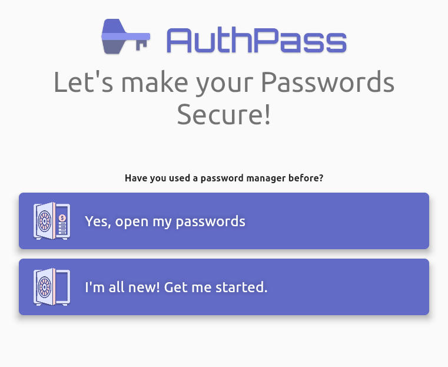

# Creating a new passwords database

### From the welcome screen

When you open the AuthPass app for the first time, you will see a screen which looks like this 

You may click on the "I'm all new! ..." button to get get started. A new screen to create a new password database will appear.

You may enter any name of your choice for the database. After that set a secure master password to protect your database.

It is highly recommended to set a long master password consisting of alphabets of both cases, digits, and special characters.

### From the selection screen

Click on the "Create New File" button if you are on the "AuthPass - Select KeyPass file"  screen as shown.

